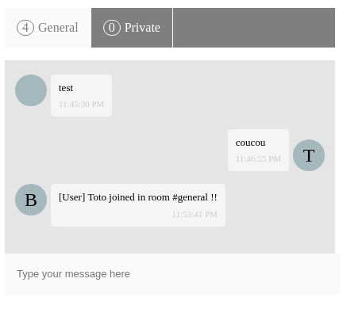

# basic-socket-chat

A basic chat using WebSocket and Angular.

## Server

Please refer to backend [README](./backend/README.md)

## Front

Web page is using Angular:

```
npm i
```

```
npm start
```

Go to localhost:4200

